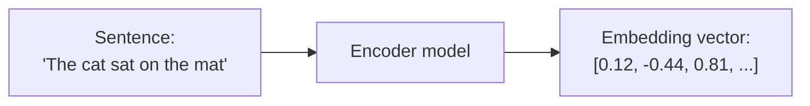
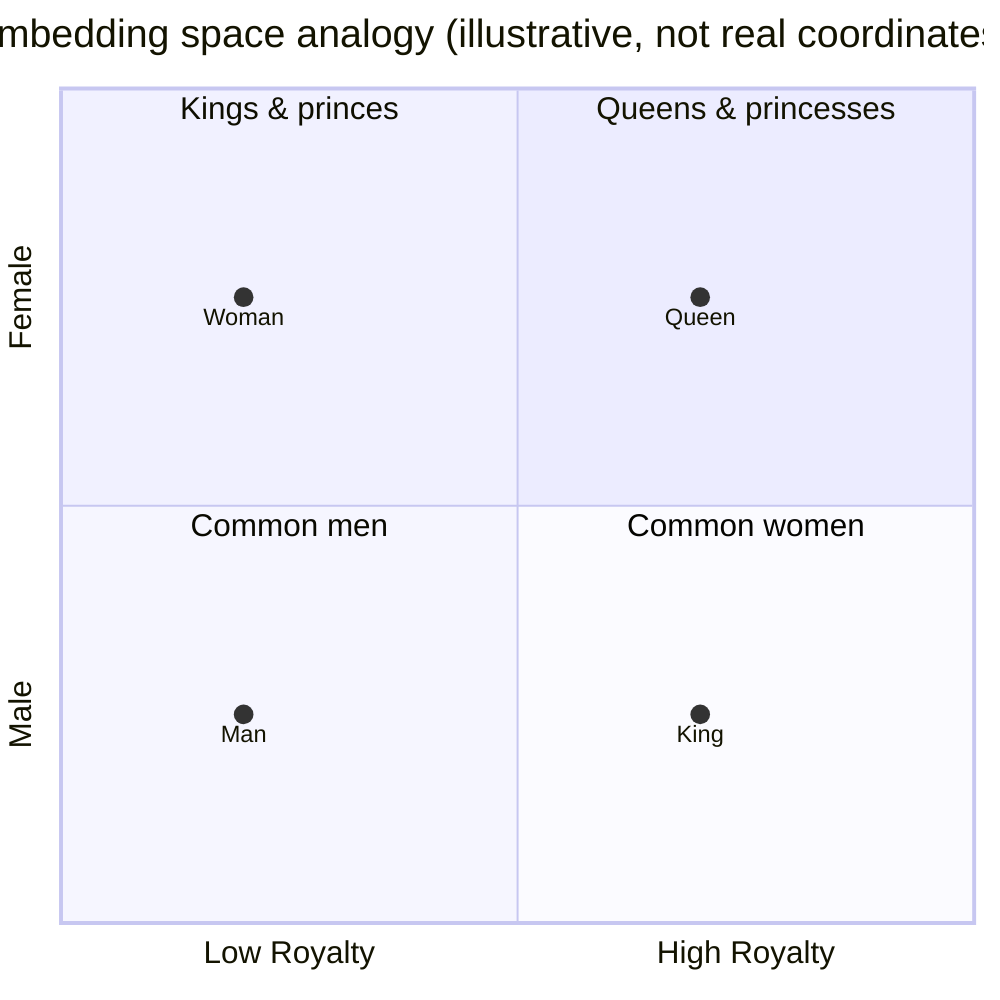
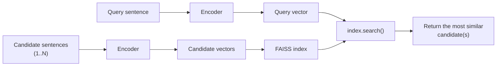

# Week 3.5 – Embeddings & Vector Search

## Goal

A short, 2-day detour before Week 4. Embeddings and vector search show up in a lot
of real ML systems (semantic search, recommendation, "find similar items",
retrieval for chatbots) — including parts of the TCDD project — so it's worth a
light, dedicated look now, separate from the supervised/unsupervised algorithms in
Week 2. As with Week 3, you build the task yourself; use your AI agent when you
get stuck.

## Schedule

| Session | Format | Focus |
|---|---|---|
| Day 1 | Self-study | What is an embedding, what is an encoder, similarity, the king/queen analogy |
| Day 2 | Build | Vector search, and a matching task you build yourself |

## Day 1 — Embeddings & Encoders

### What is an embedding?
An embedding is just a list of numbers (a vector) that represents the *meaning* of
something — a word, a sentence, an image — rather than its literal characters.
The whole point of an embedding is: things that mean similar things end up
*close together* in that vector space, and things that mean different things end
up *far apart* — even if they don't share a single word in common.

### What is an encoder?
An encoder is the model that does this conversion — text in, vector out. Modern
sentence encoders (e.g. Sentence-BERT and similar models) are trained specifically
so that sentences with similar meaning land close together in vector space, even
when phrased completely differently ("a dog is running in the park" vs. "a canine
sprints through a green field").

### How do we measure "close together"?
The standard measure is **cosine similarity** — a score from -1 to 1 (in practice
usually 0 to 1 for text) comparing the *direction* two vectors point in, not their
length. A score near 1 means "very similar meaning", near 0 means "unrelated".

### The famous king/queen example
One of the most well-known observations about embedding spaces: relationships
between words show up as consistent *directions*, not just distances. The classic
example — take the vector for "king", subtract "man", add "woman", and you land
close to "queen". The direction from "man" to "woman" (roughly, "gender") is
approximately the same direction as "king" to "queen".

Notice King→Queen and Man→Woman are the *same shift* (same horizontal position,
same vertical jump) — that's the "direction encodes relationship" idea, just drawn
in two dimensions for intuition. Real embeddings have hundreds of dimensions, not
two, and the "directions" aren't literally gender/royalty on two clean axes like
this — but this analogy is the standard simplified way the idea gets taught.

### Where encoder models actually come from
As an engineer, you're not training one of these from scratch — you download a
pretrained one, same as any other library. Hugging Face Hub (huggingface.co) is
where most of these live: search the "sentence-similarity" task on the Hub and
you'll find dozens of ready-to-download encoder models with usage snippets right
on the model card. The MTEB leaderboard (huggingface.co/spaces/mteb/leaderboard)
is how people actually pick one — it benchmarks encoder models against each other
on retrieval/similarity tasks, so you choose based on published numbers, not by
reading papers. `all-MiniLM-L6-v2` (used in the task below) is one of the smaller,
faster models on that leaderboard — good enough for this task and fast on CPU.

### Self-check (write in your log)
- In your own words: why can two sentences with *zero* words in common still have
  a high similarity score?
- Skim a couple of model cards on the Hugging Face Hub for "sentence-similarity"
  models — what information does a model card give you that you'd actually need
  before picking one for a real project (size, speed, language support, license)?

## Day 2 — Vector Search + Task

### What is vector search?
Once you can turn text into vectors, "search" becomes: encode the query, then find
which candidate vectors it's *closest to*. That's it — no keyword matching
required. This is the mechanism behind semantic search, recommendation ("find
similar products"), duplicate/plagiarism detection, and retrieval for chatbots
(finding the right document to answer a question from).

At real-world scale (millions/billions of vectors), comparing a query against
*every* candidate one by one is too slow. This is a solved problem, not something
you'd hand-roll — **FAISS** (Facebook AI Similarity Search) is the standard
library engineers reach for: you load your candidate vectors into a FAISS index
once, then every query becomes a fast `index.search()` call. (Pinecone, Chroma,
and others are hosted/managed alternatives that do the same job as a service.)
You'll use FAISS directly in the task below — even at the tiny scale of 8
sentences, it's worth using the real tool instead of a hand-written loop, since
that's what actually carries over to a real project.

### Task — Build a tiny semantic search engine

**Setup**
1. In a new Colab notebook: `pip install sentence-transformers faiss-cpu`
2. Load an encoder model from the Hugging Face Hub: `SentenceTransformer('all-MiniLM-L6-v2')` — free, runs on CPU, no API key needed.

**Build your own two lists of sentences**
- **List A (queries)** — at least 6 sentences.
- **List B (candidates)** — at least 8 sentences: one true match for every item in
  List A, plus a few unrelated "decoy" sentences.
- The important part: for at least 2 of your pairs, make the correct match use
  **completely different words** than the query (a real paraphrase, not just a
  synonym swap) — that's what actually tests whether the model is matching by
  meaning rather than shared words.

**Index and search**
3. Encode List B: `vectors = model.encode(list_b, normalize_embeddings=True)`.
4. Build a FAISS index and add the vectors to it: `index = faiss.IndexFlatIP(vectors.shape[1])` then `index.add(vectors)` — `IndexFlatIP` (inner product) on normalized vectors is equivalent to cosine similarity, which is why we normalized above.
5. Encode List A the same way, then run `scores, indices = index.search(query_vectors, k=1)` — `indices` gives you the position of the best-matching sentence in List B for each query, `scores` gives you its similarity score.
6. Print each query next to its retrieved match (using `indices` to look the sentence back up in List B) and its score.
7. Compare the retrieved matches to what *you* intended when you wrote the lists —
   how many did it get right?

**Then experiment**
- Add a query with *no* real match anywhere in List B — what similarity score does
  its "best match" get? Is there a score threshold where you'd trust a match vs.
  not?
- Compare two of your own sentences that mean nearly the same thing but share zero
  words — what's their similarity?
- Compare two sentences that share many words but mean different or opposite
  things (e.g. "the meeting starts at 5pm" vs. "the meeting was cancelled at 5pm")
  — what's their similarity? Does it surprise you?

### Log questions
- What did you learn about how well similarity scores reflect actual *meaning*
  versus just shared words?
- You used `IndexFlatIP`, which checks the query against every single vector — fine
  at 8 candidates. If List B had 1,000,000 candidates, that stops being fast
  enough. Look up "FAISS approximate index" (e.g. `IndexIVFFlat` or `IndexHNSW`) —
  in one or two sentences, what's the trade-off it makes to stay fast at that
  scale?

Bring your notebook and observations to your next regular meeting before starting
Week 4.

---

## Alper's Log

### Day 1 — Embeddings & Encoders

**Self-check 1: Ortak hiç kelimesi olmayan iki cümle nasıl yüksek benzerlik
skoru alabilir?**

Çünkü karşılaştırma yapıldığı anda kelimeler ortada yok. Encoder cümleyi bir
vektöre çeviriyor ve benzerlik hesabı iki sayı listesi arasında yapılıyor,
cümlelerin kendisi arasında değil. Model "bu ikisinde kaç ortak kelime var"
diye bir karşılaştırma hiç yapmıyor — yapamaz, çünkü kelimeler o aşamada
çoktan atılmış.

Vektörlerin benzer çıkmasının sebebi, encoder'ın tam olarak bunun için
eğitilmiş olması: anlamca yakın cümleleri uzayda yakın yerlere koyacak
şekilde ayarlanmış. Eğitim sırasında benzer bağlamlarda geçen kelimelere
benzer vektörler atamayı öğrenmiş. Bu yüzden "parkta bir köpek koşuyor" ile
"yeşil bir alanda bir kanin ilerliyor" ortak kelimesi olmamasına rağmen yakın
vektörler alıyor.

Benzerliğin cosine similarity ile ölçülmesi de önemli: bu ölçü iki vektörün
arasındaki AÇIYA bakıyor, uzunluklarına değil. Vektörün uzunluğu genelde
cümlenin uzunluğu ve vurgusuyla ilgili, anlamıyla değil.

**Self-check 2: Model card gerçek bir projede neyi söylüyor?**

İki model card'a baktım: all-MiniLM-L6-v2 (bu görevde kullandığım) ve
multilingual-e5-large. Seçim yaparken lazım olacak beş şey buldum:

1. Vektör boyutu — all-MiniLM-L6-v2 384 boyutlu vektör üretiyor. Depolama ve
   arama maliyetini doğrudan belirliyor.
2. Maksimum uzunluk — 256 token. Daha uzun metinler sessizce kesiliyor. Uzun
   bir belgeyi encode edersem sadece başını temsil eden bir vektör alırım ve
   model bana bunu söylemez.
3. Lisans — Apache 2.0, ticari kullanıma açık. Bazı modeller sadece araştırma
   lisanslı; skor tablosunda birinci olsa bile şirket projesinde kullanılamaz.
4. Dil desteği — all-MiniLM-L6-v2 İngilizce eğitilmiş, "multilingual"
   geçmiyor. multilingual-e5-large çok dilli ve MIT lisanslı ama adındaki
   "large" daha ağır ve yavaş olduğunu söylüyor.
5. Nasıl eğitildiği — 1 milyardan fazla cümle çiftiyle kontrastif hedefle ince
   ayar yapılmış. Yani modele "bu ikisi eşleşiyor, bu ikisi eşleşmiyor" diye
   milyarlarca örnek gösterilmiş.

Çıkarım: model seçimi bir takas. Küçük ve hızlı ama tek dilli, ya da çok dilli
ve doğru ama ağır. TCDD verisi Türkçe ise all-MiniLM-L6-v2 MTEB sıralamasında
kaçıncı olduğuna bakılmadan zaten eleniyor.

### Day 2 — Vector Search

**Ne inşa ettim**

sentence-transformers ile all-MiniLM-L6-v2 modelini yükleyip 6 sorgu (List A)
ve 9 aday cümleden (List B) oluşan iki liste yazdım. List B'yi
normalize_embeddings=True ile encode edip FAISS IndexFlatIP indeksine ekledim,
sonra her sorgu için en yakın eşleşmeyi arattım. Normalize ettiğim için iç
çarpım cosine similarity'ye eşit oluyor.

Adayların 3 tanesi hiçbir sorguyla eşleşmeyen tuzak cümleydi. Çiftlerin
4 tanesinde sorgu ile doğru cevap arasında neredeyse sıfır kelime örtüşmesi
olacak şekilde kurguladım (umbrella↔showers, laptop↔machine,
running shoes↔sneakers, friend↔buddy).

**Tahmin vs gerçek**

Kodu çalıştırmadan önce her çift için modelin bulup bulamayacağını tahmin
ettim. 6 tahminden 4'ü tuttu; model 6 sorgudan 5'ini doğru eşleştirdi.

| # | Çift | Tahminim | Gerçek | Skor |
|---|------|----------|--------|------|
| 1 | model eğitme (ortak kelimeli) | bulur | bulur | 0.8048 |
| 2 | umbrella ↔ showers | bulamaz | **bulamadı** | 0.3220 |
| 3 | laptop ↔ machine powers off | bulamaz | buldu | 0.4033 |
| 4 | cheap running shoes ↔ affordable sneakers | bulur | buldu | 0.6748 |
| 5 | friend ↔ buddy | bulur | buldu | 0.7055 |
| 6 | rent Istanbul (ortak kelimeli) | bulamaz | buldu | 0.7838 |

**Tek başarısızlık: umbrella**

"Will I need an umbrella tomorrow?" sorgusuna model hava durumu cümlesini
değil, "Planning to hang out with a buddy on Saturday" cümlesini getirdi.

Sebebini düşününce anladım: şemsiye ile sağanak arasındaki bağ anlamsal
benzerlik değil, dünya bilgisi. "Şemsiye gerekir mi" demek "yağmur yağacak mı"
demek, ama bunu bilmek için bir çıkarım yapmak gerekiyor. Encoder çıkarım
yapmıyor, sadece cümlelerin benzer bağlamlarda geçip geçmediğine bakıyor.
Buddy cümlesini seçmesinin sebebi muhtemelen ikisinde de gelecek zamanlı bir
plan olması ("tomorrow" / "Saturday") — konuya değil, cümlenin şekline
takılmış.

Çıkarım: anlam yakınlığı ile mantıksal ilişki aynı şey değil.

**Skor eşiği deneyi**

Üç seviye ölçtüm:
- En düşük DOĞRU eşleşme (laptop): 0.4033
- YANLIŞ eşleşme (umbrella): 0.3220
- HİÇ karşılığı olmayan sorgu ("What is the boiling point of water?"): 0.1940

Yani 0.36 civarı bir eşik hem alakasız sorguyu hem yanlış eşleşmeyi reddeder,
beş doğru eşleşmeyi kabul ederdi. Eşik mümkün ama payı ince — doğru ile yanlış
arasında sadece 0.08 var. 9 cümlelik bir oyuncakta bu kadar; binlerce adayda
skorlar birbirine yaklaşır ve bu boşluk kapanır.

Ayrıca fark ettim ki k=1 dediğim için FAISS her sorguya MUTLAKA bir cevap
döndürüyor. "Eşleşme yok" diye bir seçenek sunmuyor. Eşiği ben koymazsam
sistem her zaman bir şey bulacak, tamamen alakasız olsa bile. Alakasız sorguda
birinci sırada un ve bardak ölçüsünden bahseden tarif cümlesi geldi — skor
düşük ama seçim mantıklı, ikisi de mutfak/su dünyasından.

**En çarpıcı bulgu: zıt anlam, aynı anlamdan yüksek skor aldı**

| Skor | Çift | Anlam ilişkisi |
|------|------|----------------|
| 0.6901 | "The meeting starts at 5pm" ↔ "The meeting was cancelled at 5pm" | ZIT |
| 0.3811 | "My car broke down..." ↔ "The vehicle was in the workshop..." | AYNI |
| 0.2862 | "Which team do you support?" ↔ "Did my team win?" | FARKLI |

Zıt anlamlı çift, aynı anlamlı çiftin neredeyse iki katı skor aldı.

Sebebi: encoder cümlenin NEYLE İLGİLİ olduğunu yakalıyor, NE İDDİA ETTİĞİNİ
değil. İki toplantı cümlesi de aynı toplantı, aynı saat, neredeyse aynı
kelimeler. "Biri oluyor, diğeri olmuyor" ayrımı tek bir kelimede saklı
(cancelled) ve 384 boyutlu vektörde o tek kelimenin ağırlığı geri kalan
örtüşmenin yanında küçük kalıyor. Bunun olumsuzluk (negation) problemi diye
bilinen bir zaaf olduğunu öğrendim — "bu ilaç güvenlidir" ile "bu ilaç güvenli
değildir" de yüksek benzerlik alır.

Takım çiftinin düşük çıkması da öğreticiydi: orada gerçekten farklı iki şey
soruluyor ve ortak kelime olmasına rağmen cümlelerin geri kalanı ayrışıyor.
Yani model salt kelime saymıyor; toplantı örneğinde skorun yüksek olmasının
sebebi cümlenin neredeyse tamamının aynı olması.

Kendi tasarladığım "zor paraphrase" (araba/servis) sadece 0.3811 aldı —
alakasız sorgunun 0.1940'ından iyi ama laptop eşleşmesinin 0.4033'üne bile
ulaşamadı. Gerçek paraphrase modeli ciddi şekilde zorluyor.

### Log sorusu 1 — Benzerlik skorları gerçek anlamı mı, ortak kelimeleri mi
yansıtıyor?

İkisinin karışımını, ve kelime örtüşmesi yüksek olduğunda anlam geri planda
kalıyor.

Ortak kelimesi sıfır olan gerçek paraphrase'ları bulabiliyor (laptop↔machine,
running shoes↔sneakers, friend↔buddy) — yani salt kelime eşleştirme yapmıyor,
bu kısım gerçekten çalışıyor. Ama iki yerde tökezliyor:
- Kelime örtüşmesi çok yüksek olduğunda anlam farkını kaçırıyor (toplantı
  örneği: zıt anlam, 0.69).
- Çıkarım gerektiren ilişkileri hiç kuramıyor (umbrella örneği).

Pratik sonuç: bu skorlara bir eşik koyup otomatik karar verdirecek bir sistem
kuruyorsam, hem yanlış pozitifleri (zıt anlamlı ama yüksek skorlu) hem yanlış
negatifleri (gerçek paraphrase ama düşük skorlu) hesaba katmam gerekiyor.

### Log sorusu 2 — IndexFlatIP 1.000.000 adayda ne olur?

"Flat" hiçbir kısayol kullanmadan sorguyu her vektörle tek tek karşılaştırıyor.
9 adayda sorun değil ama 1.000.000 aday × 384 boyut, sorgu başına yüz
milyonlarca çarpma demek. Saniyede yüzlerce sorgu gelen bir sistemde tıkanır.
(2. haftada KNN'in tahmin anında yavaş olmasıyla tam olarak aynı problem —
her tahminde tüm veriyle mesafe hesaplamak.)

Çözüm yaklaşık (approximate) indeksler:
- **IndexIVFFlat** vektörleri önce kümelere ayırıyor (K-Means ile — Task E'de
  öğrendiğim şey burada işe yarıyor) ve sorguda tüm veri yerine sadece en
  yakın birkaç kümenin içini tarıyor. 1000 kümeye bölünüp 10'una bakılıyorsa
  işin çoğu atlanmış oluyor. Riski: doğru cevap bakılmayan bir kümenin
  kenarındaysa kaçırılıyor.
- **IndexHNSW** vektörleri bir gezinme ağı olarak bağlayıp "hangi komşum
  sorguya daha yakın" diye adım adım ilerliyor. Genelde IVF'ten hızlı ve daha
  doğru ama bellekte çok daha fazla yer kaplıyor (her vektör için bağlantı
  listesi tutuyor).

Takas: kesin doğru sonuçtan biraz feragat edip hızda katlarca kazanıyorsun.
Semantic search'te makul bir takas, çünkü "en yakın 10 sonuç" isteniyor ve
7. sıradaki bir sonucun kaçması fark edilmiyor. Ama kesinlik gerektiren bir
işte (tam eşleşen kaydı bul) yaklaşık indeks kullanılamaz.

### Kafamı karıştıran 

- Zıt anlamlı cümlelerin yüksek skor alması beni en çok şaşırtan şey oldu.
  Gerçek sistemlerde bu nasıl çözülüyor? Cross-encoder veya reranker gibi bir
  ek katman mı devreye giriyor?
- Eşik seçimi bana keyfi geldi. Gerçek bir projede eşik nasıl belirleniyor —
  etiketli bir doğrulama seti üzerinden mi ayarlanıyor?
- Model İngilizce eğitilmiş ve Türkçe metinde hata VERMİYOR, sessizce kötü
  sonuç üretiyor. TCDD verisi Türkçe ise çok dilli bir model mi kullanacağız,
  yoksa metinleri çevirmek gibi bir yaklaşım mı var?
