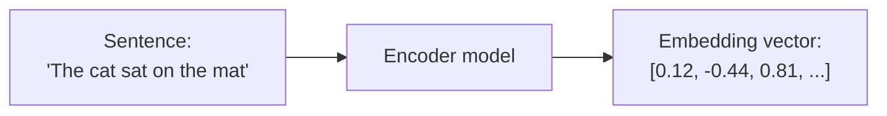
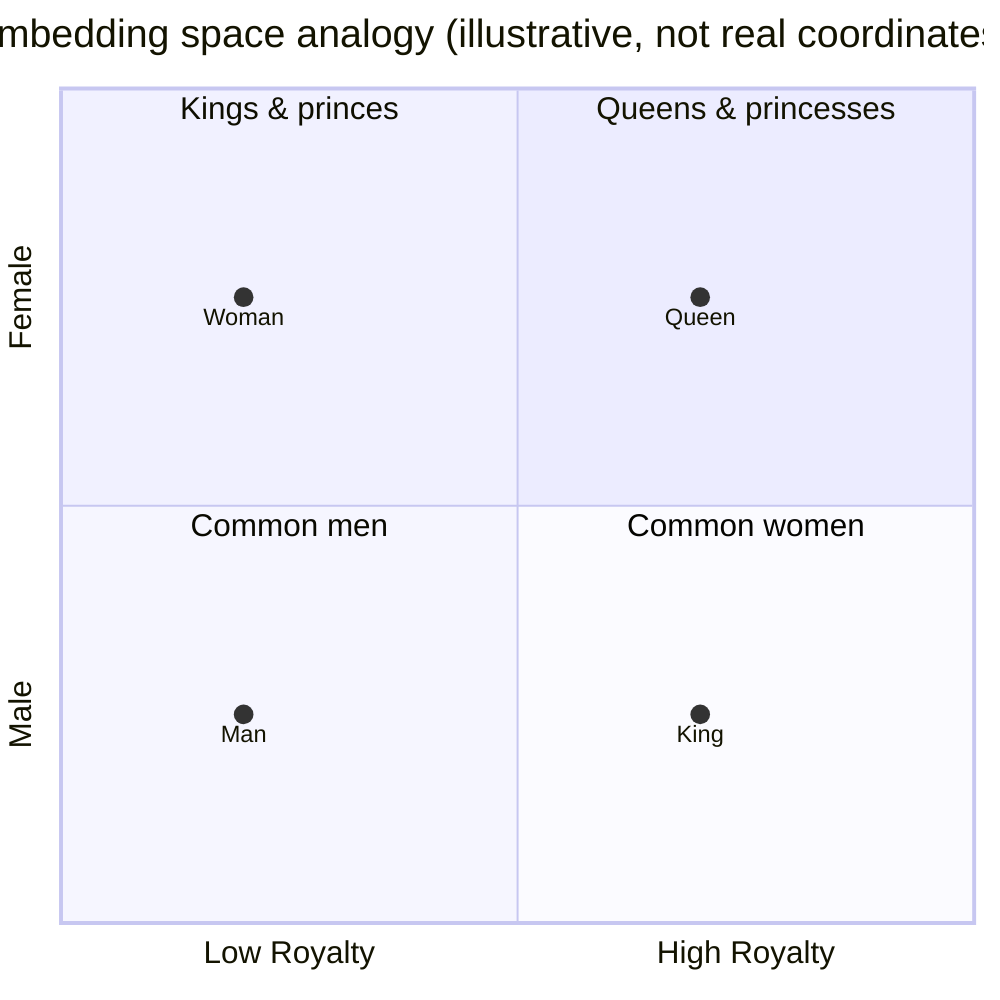
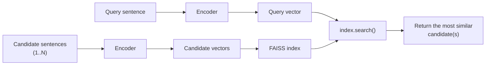

# Week 3.5 – Embeddings & Vector Search

## Goal

A short, 2-day detour before Week 4. Embeddings and vector search show up in a lot
of real ML systems (semantic search, recommendation, "find similar items",
retrieval for chatbots) — including parts of the TCDD project — so it's worth a
light, dedicated look now, separate from the supervised/unsupervised algorithms in
Week 2. As with Week 3, you build the task yourself; use your AI agent when you
get stuck.

## Schedule

| Session | Format | Focus |
|---|---|---|
| Day 1 | Self-study | What is an embedding, what is an encoder, similarity, the king/queen analogy |
| Day 2 | Build | Vector search, and a matching task you build yourself |

## Day 1 — Embeddings & Encoders

### What is an embedding?
An embedding is just a list of numbers (a vector) that represents the *meaning* of
something — a word, a sentence, an image — rather than its literal characters.
The whole point of an embedding is: things that mean similar things end up
*close together* in that vector space, and things that mean different things end
up *far apart* — even if they don't share a single word in common.

### What is an encoder?
An encoder is the model that does this conversion — text in, vector out. Modern
sentence encoders (e.g. Sentence-BERT and similar models) are trained specifically
so that sentences with similar meaning land close together in vector space, even
when phrased completely differently ("a dog is running in the park" vs. "a canine
sprints through a green field").

### How do we measure "close together"?
The standard measure is **cosine similarity** — a score from -1 to 1 (in practice
usually 0 to 1 for text) comparing the *direction* two vectors point in, not their
length. A score near 1 means "very similar meaning", near 0 means "unrelated".

### The famous king/queen example
One of the most well-known observations about embedding spaces: relationships
between words show up as consistent *directions*, not just distances. The classic
example — take the vector for "king", subtract "man", add "woman", and you land
close to "queen". The direction from "man" to "woman" (roughly, "gender") is
approximately the same direction as "king" to "queen".

Notice King→Queen and Man→Woman are the *same shift* (same horizontal position,
same vertical jump) — that's the "direction encodes relationship" idea, just drawn
in two dimensions for intuition. Real embeddings have hundreds of dimensions, not
two, and the "directions" aren't literally gender/royalty on two clean axes like
this — but this analogy is the standard simplified way the idea gets taught.

### Where encoder models actually come from
As an engineer, you're not training one of these from scratch — you download a
pretrained one, same as any other library. Hugging Face Hub (huggingface.co) is
where most of these live: search the "sentence-similarity" task on the Hub and
you'll find dozens of ready-to-download encoder models with usage snippets right
on the model card. The MTEB leaderboard (huggingface.co/spaces/mteb/leaderboard)
is how people actually pick one — it benchmarks encoder models against each other
on retrieval/similarity tasks, so you choose based on published numbers, not by
reading papers. `all-MiniLM-L6-v2` (used in the task below) is one of the smaller,
faster models on that leaderboard — good enough for this task and fast on CPU.

### Self-check (write in your log)
- In your own words: why can two sentences with *zero* words in common still have
  a high similarity score?
- Skim a couple of model cards on the Hugging Face Hub for "sentence-similarity"
  models — what information does a model card give you that you'd actually need
  before picking one for a real project (size, speed, language support, license)?

## Day 2 — Vector Search + Task

### What is vector search?
Once you can turn text into vectors, "search" becomes: encode the query, then find
which candidate vectors it's *closest to*. That's it — no keyword matching
required. This is the mechanism behind semantic search, recommendation ("find
similar products"), duplicate/plagiarism detection, and retrieval for chatbots
(finding the right document to answer a question from).

At real-world scale (millions/billions of vectors), comparing a query against
*every* candidate one by one is too slow. This is a solved problem, not something
you'd hand-roll — **FAISS** (Facebook AI Similarity Search) is the standard
library engineers reach for: you load your candidate vectors into a FAISS index
once, then every query becomes a fast `index.search()` call. (Pinecone, Chroma,
and others are hosted/managed alternatives that do the same job as a service.)
You'll use FAISS directly in the task below — even at the tiny scale of 8
sentences, it's worth using the real tool instead of a hand-written loop, since
that's what actually carries over to a real project.

### Task — Build a tiny semantic search engine

**Setup**
1. In a new Colab notebook: `pip install sentence-transformers faiss-cpu`
2. Load an encoder model from the Hugging Face Hub: `SentenceTransformer('all-MiniLM-L6-v2')` — free, runs on CPU, no API key needed.

**Build your own two lists of sentences**
- **List A (queries)** — at least 6 sentences.
- **List B (candidates)** — at least 8 sentences: one true match for every item in
  List A, plus a few unrelated "decoy" sentences.
- The important part: for at least 2 of your pairs, make the correct match use
  **completely different words** than the query (a real paraphrase, not just a
  synonym swap) — that's what actually tests whether the model is matching by
  meaning rather than shared words.

**Index and search**
3. Encode List B: `vectors = model.encode(list_b, normalize_embeddings=True)`.
4. Build a FAISS index and add the vectors to it: `index = faiss.IndexFlatIP(vectors.shape[1])` then `index.add(vectors)` — `IndexFlatIP` (inner product) on normalized vectors is equivalent to cosine similarity, which is why we normalized above.
5. Encode List A the same way, then run `scores, indices = index.search(query_vectors, k=1)` — `indices` gives you the position of the best-matching sentence in List B for each query, `scores` gives you its similarity score.
6. Print each query next to its retrieved match (using `indices` to look the sentence back up in List B) and its score.
7. Compare the retrieved matches to what *you* intended when you wrote the lists —
   how many did it get right?

**Then experiment**
- Add a query with *no* real match anywhere in List B — what similarity score does
  its "best match" get? Is there a score threshold where you'd trust a match vs.
  not?
- Compare two of your own sentences that mean nearly the same thing but share zero
  words — what's their similarity?
- Compare two sentences that share many words but mean different or opposite
  things (e.g. "the meeting starts at 5pm" vs. "the meeting was cancelled at 5pm")
  — what's their similarity? Does it surprise you?

### Log questions
- What did you learn about how well similarity scores reflect actual *meaning*
  versus just shared words?
- You used `IndexFlatIP`, which checks the query against every single vector — fine
  at 8 candidates. If List B had 1,000,000 candidates, that stops being fast
  enough. Look up "FAISS approximate index" (e.g. `IndexIVFFlat` or `IndexHNSW`) —
  in one or two sentences, what's the trade-off it makes to stay fast at that
  scale?

Bring your notebook and observations to your next regular meeting before starting
Week 4.

---

## Alper's Log
*(append your notes below as you go — what you did, what was confusing, what you'd want explained again)*
